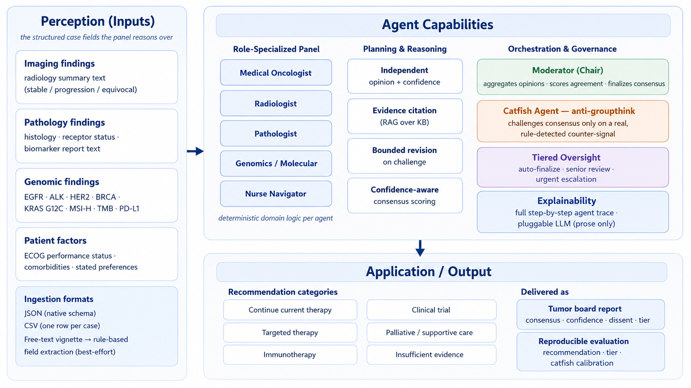

<h1 align="center">TumorBoard-Agent 🧬🩺</h1>

<p align="center"><b>A simulated multi-agent molecular tumor board for oncology decision support</b></p>

<p align="center">
  
  
  
  
  
  
  
</p>

TumorBoard-Agent simulates an oncology **molecular tumor board (MTB)**: five
specialist agents independently assess a case and debate over structured rounds,
a dedicated **catfish agent** challenges premature consensus, and a **tiered
oversight agent** decides whether the panel's conclusion can auto-finalize or
must be escalated to human review. It ships with a reproducible **evaluation
harness** scoring recommendation accuracy, escalation-tier accuracy, and
catfish-trigger calibration — and runs fully offline with no API keys.

> ⚠️ **Educational / research prototype only. Not a medical device.** It uses
> only synthetic cases and a small, original, non-clinical knowledge base, and
> must never be used for diagnosis, treatment, or clinical decision-making.
> See [Disclaimer](#disclaimer).

## Where this sits in the field

TumorBoard-Agent maps onto the standard **Perception → Agent Capabilities →
Application** framework used across the agentic-healthcare literature — but
every box below is a component that actually exists in this repository, not an
aspiration.



## Why this project is interesting

Most "medical AI agent" demos are a single LLM with a system prompt. This one
implements several patterns that appear in the recent research literature on
agentic AI for healthcare, made explicit, auditable, and testable:

- **Role-specialized multi-agent collaboration** — five specialists
  (Medical Oncologist, Radiologist, Pathologist, Genomics/Molecular, Nurse
  Navigator) each reason over a different slice of the case with their own
  deterministic domain logic, then a Moderator aggregates.
- **Anti-groupthink by design** — a *catfish agent* deliberately challenges
  consensus, but only when a true majority has formed **and** a specific,
  rule-detected counter-signal exists that the majority's own rationale hasn't
  accounted for. It never manufactures disagreement for show; staying silent
  when there's no real objection is treated as correct behavior and is tested.
- **Tiered agentic oversight** — not every consensus is trusted equally.
  Confident, unanimous, unchallenged conclusions can `AUTO_FINALIZE`;
  anything contested, low-confidence, or flagged is routed to `SENIOR_REVIEW`
  or `URGENT_ESCALATION` instead of being silently accepted.
- **Decisions are deterministic; the LLM only phrases prose** — every
  clinically meaningful output (recommendation category, confidence, tier)
  comes from auditable rule logic, not free generation. The pluggable LLM
  backend only rewords an already-decided rationale. This keeps the system
  testable and free of hallucination risk in the part that matters.
- **Explainable trace + real evaluation** — every agent step is logged, and a
  gold-labeled eval harness turns "it seems to work" into measured
  recommendation / tier / calibration accuracy.

## Architecture

```
                              ┌──────────────── CASE (structured) ───────────────┐
                              │ imaging · pathology · genomics · patient factors │
                              └──────────────────────┬───────────────────────────┘
                                                     v
        ┌───────────────┬───────────────┬───────────────┬───────────────┬───────────────┐
        │  Medical      │  Radiologist  │  Pathologist  │  Genomics /   │  Nurse        │
        │  Oncologist   │               │               │  Molecular    │  Navigator    │
        └───────┬───────┴───────┬───────┴───────┬───────┴───────┬───────┴───────┬───────┘
                └───────────────┴──────── independent opinions ──┴───────────────┘
                                                     v
                                          ┌────────────────────┐
                                          │  Moderator (Chair)  │  scores agreement
                                          └──────────┬─────────┘
                                                     v
                                          ┌────────────────────┐   speaks up ONLY if a
                                          │   Catfish agent     │   real counter-signal
                                          └──────────┬─────────┘   exists  → next round
                                                     v  (challenge → specialists revise)
                                          ┌────────────────────┐
                                          │  Moderator finalize │
                                          └──────────┬─────────┘
                                                     v
                                          ┌────────────────────┐   AUTO_FINALIZE /
                                          │  Oversight agent    │   SENIOR_REVIEW /
                                          └──────────┬─────────┘   URGENT_ESCALATION
                                                     v
                                    TumorBoardReport + full agent trace
```

The whole flow is coordinated by `TumorBoardOrchestrator` in plain Python — no
agent-framework dependency — so the control flow is fully visible in review.

## Design patterns and their research grounding

The design deliberately mirrors patterns from recent agentic-healthcare
research (references at the bottom). This project is an original,
from-scratch, synthetic-data implementation *inspired by* these ideas — not a
reimplementation of any specific paper's code.

| Component in this repo | Pattern it demonstrates | Inspired by |
|---|---|---|
| Catfish agent | Disrupting agreement bias / groupthink in multi-agent clinical decisions | *Silence is Not Consensus* (Catfish Agent), 2025 |
| Oversight agent (3-tier) | Hierarchical safety oversight of agent conclusions | *Tiered Agentic Oversight*, 2026 |
| 5 role-specialized agents + Moderator | Multi-agent MDT / tumor-board collaboration | *Multi-Agent … Oncology MDT Consultations* (2025); *Evaluation of Multi-Agent LLMs in MDT Decision-Making for Cancer Cases* (MLHC 2025) |
| Confidence-aware consensus + escalation | Confidence-aware multi-agent collaboration | *MedCoAct* / *ConfAgents*, 2025 |
| Eval harness (accuracy + calibration) | Benchmarking multi-agent medical systems | *MedAgentBoard*, 2025 |

## Project layout

```
tumorboard_agent/
  schemas.py               Pydantic models (Case, opinions, consensus, report)
  oncology_knowledge.py     Structured actionable-finding logic (decisive)
  knowledge_base.py         TF-IDF retrieval for citation grounding
  llm_provider.py           Pluggable LLM backend (template / Anthropic / OpenAI)
  case_loader.py            Parse uploaded JSON / CSV / free-text into Cases
  diagram.py                Inline SVG agent-architecture diagram for the app
  agents/
    base_specialist.py      Shared specialist base + catfish-revision logic
    oncologist_agent.py      Medical Oncologist
    radiologist_agent.py     Radiologist
    pathologist_agent.py     Pathologist
    genomics_agent.py        Genomics / Molecular
    navigator_agent.py       Nurse Navigator (patient-centered factors)
    moderator_agent.py       Chair: aggregation, agreement scoring, finalize
    catfish_agent.py         Anti-groupthink challenger
    oversight_agent.py       Tiered escalation decision
  orchestrator.py           Runs the full multi-round debate + trace
data/
  knowledge_base.json       Synthetic, original free-text guidance snippets
  synthetic_cases.json      7 fictional cases exercising each pathway
  eval_gold.json            Expected outcomes for the eval harness
cli.py                      Command-line entry point
app.py                      Streamlit UI (same pipeline, browser front end)
eval.py                     Evaluation harness
scripts/render_figures.py   Regenerate docs/*.png and docs/*.svg
docs/                       Rendered framework landscape figure (png + svg)
tests/test_pipeline.py      Pytest suite: agents, pipeline, eval battery
tests/test_case_loader.py   Pytest suite: JSON/CSV/free-text upload parsing
```

## Running it

```bash
pip install -r requirements.txt

# Run all synthetic cases
python cli.py --demo

# Run one case with the full agent trace (case-002 shows the catfish
# flipping the panel from 'continue therapy' to 'supportive care')
python cli.py --demo-id case-002 --trace

# Reproducible evaluation
python eval.py

# Tests
pytest tests/ -v

# Interactive demo UI (framework figure + demo cases + upload your own)
streamlit run app.py
```

Everything runs fully offline with no API keys and no external model downloads.

### Uploading your own case

The Streamlit app has an **Upload your own case** tab that accepts three formats:

- **JSON** — the native schema (a single case object or a list). Best fidelity.
- **CSV** — one row per case; use `;` to separate multiple genomic findings or
  comorbidities in a cell. Columns: `case_id, cancer_type, stage,
  imaging_findings, pathology_findings, genomic_findings, performance_status,
  comorbidities, patient_preferences`.
- **Plain text (`.txt`)** — a free-text clinical vignette. A lightweight,
  rule-based converter extracts the structured fields (cancer type, ECOG
  status, listed biomarkers, and the imaging/pathology/preference sentences)
  and shows you exactly what it could and couldn't parse before you run it.
  Separate multiple vignettes with a line containing only `---`.

The app renders a full input-format guide with copy-paste examples, and every
upload is validated against the schema, so malformed input fails with a clear
message instead of silently producing a bad case. If your source is a PDF/Word
doc, copy the text into a `.txt` file; if you have a FHIR/EHR export, map the
fields you care about into the CSV columns (the demo does not ingest raw FHIR
bundles directly).

### Live demo

`app.py` wraps the same `TumorBoardOrchestrator`. To publish a shareable link:
push to GitHub, then deploy on [share.streamlit.io](https://share.streamlit.io)
pointing at `app.py`. No secrets required for the default offline mode.

### Optional real-LLM prose

The rationale narratives can be phrased by a real model instead of the offline
template. The **decisions never change** — only the wording does — which is the
point: the clinically meaningful logic stays deterministic and testable.

Three ways to enable it, in order of convenience:

1. **In the app sidebar** — pick "Anthropic (Claude)" or "OpenAI (GPT)" under
   *Rationale phrasing (LLM)* and paste an API key. The key is used only for
   that session to build the client; it is not written to disk or logged.
   Requires the matching SDK (`pip install anthropic` or `pip install openai`).
2. **Environment variable** — set `ANTHROPIC_API_KEY` or `OPENAI_API_KEY`
   before launching; the app and CLI pick it up automatically.
3. **Streamlit Cloud secrets** — for a deployed public demo, add the key as a
   secret rather than pasting it in the UI.

If no key is provided (or the SDK isn't installed), everything runs in offline
template mode.

## Example: the catfish changing an outcome (case-002)

```
Round 1 -- majority: continue_current_therapy (agreement 80%)
  [MedicalOncologist ] continue_current_therapy   conf=0.7
  [Radiologist       ] continue_current_therapy   conf=0.75
  ...
  >> CATFISH [performance_status_conflict]: The panel is converging on
     continue current therapy, but the patient's performance status is
     'ECOG 3, largely bed-bound'. Intensive therapy may not be tolerated.
Round 2 -- majority: palliative_supportive_care (agreement 60%)
FINAL: palliative_supportive_care | OVERSIGHT TIER: SENIOR_REVIEW
```

## Evaluation results

On the 7-case synthetic battery, the current logic scores 100% on all three
metrics. These cases are hand-authored to exercise each decision pathway, so
this is a **calibration / regression check that the system behaves as designed**,
not a claim of clinical accuracy on real data — a distinction the README keeps
deliberately explicit.

```
Recommendation accuracy: 7/7 (100%)
Tier accuracy:           7/7 (100%)
Catfish calibration:     7/7 (100%)
```

## What I'd do differently for production

- Replace the synthetic knowledge base with a real, licensed, versioned
  clinical knowledge source (e.g. curated guideline / actionable-variant
  databases) behind a proper retrieval + citation pipeline.
- Move the specialists' rule logic to a learned or hybrid layer evaluated
  against real, de-identified, properly consented tumor-board decisions —
  and expand the eval set to hundreds of cases with clinician-adjudicated
  labels, reporting per-class precision/recall rather than a single accuracy.
- Add actual imaging / pathology model tools (the current Radiologist and
  Pathologist agents reason over structured findings text, not raw images).
- Formalize the oversight tiers against a real governance / accountability
  framework rather than hand-tuned thresholds.

## Disclaimer

Personal engineering portfolio project. Not a certified medical device, not
clinically validated, uses only synthetic data, and must not be used to make
real healthcare decisions. Nothing here is medical advice.

## Author

Built by Sanaz Jamalzadeh, PhD — AI & Digital Health Innovation. Background in
oncology, digital pathology, and European health-data regulation (EHDS, EU AI
Act), with hands-on generative-AI engineering.

## References

Design inspiration drawn from the *Awesome-AI-Agents-for-Healthcare* survey
repository (AgenticHealthAI) and, specifically, these listed works:

1. *Silence is Not Consensus: Disrupting Agreement Bias in Multi-Agent LLMs via
   Catfish Agent for Clinical Decision Making* (arXiv 2505.21503, 2025).
2. *Tiered Agentic Oversight: A Hierarchical Multi-Agent System for Healthcare
   Safety* (arXiv 2506.12482, 2026).
3. *Multi-Agent Medical Decision Consensus Matrix System: An Intelligent
   Collaborative Framework for Oncology MDT Consultations* (arXiv 2512.14321,
   2025).
4. *Evaluation of Multi-Agent LLMs in Multidisciplinary Team Decision-Making for
   Challenging Cancer Cases* (MLHC 2025).
5. *MedCoAct: Confidence-Aware Multi-Agent Collaboration for Complete Clinical
   Decision* (arXiv 2510.10461, 2025).
6. *ConfAgents: A Conformal-Guided Multi-Agent Framework for Cost-Efficient
   Medical Diagnosis* (arXiv 2508.04915, 2025).
7. *MedAgentBoard: Benchmarking Multi-Agent Collaboration with Conventional
   Methods for Diverse Medical Tasks* (arXiv 2505.12371, NeurIPS 2025).

All implementation here is original and synthetic; no paper's code or data was
copied.

The "framework landscape" figure (`docs/landscape.png`) is an original
redrawing, structured after the conceptual Perception → Capabilities →
Application layout popularized by the survey repository's landscape figure, but
redrawn from scratch and populated entirely with this project's own components.
